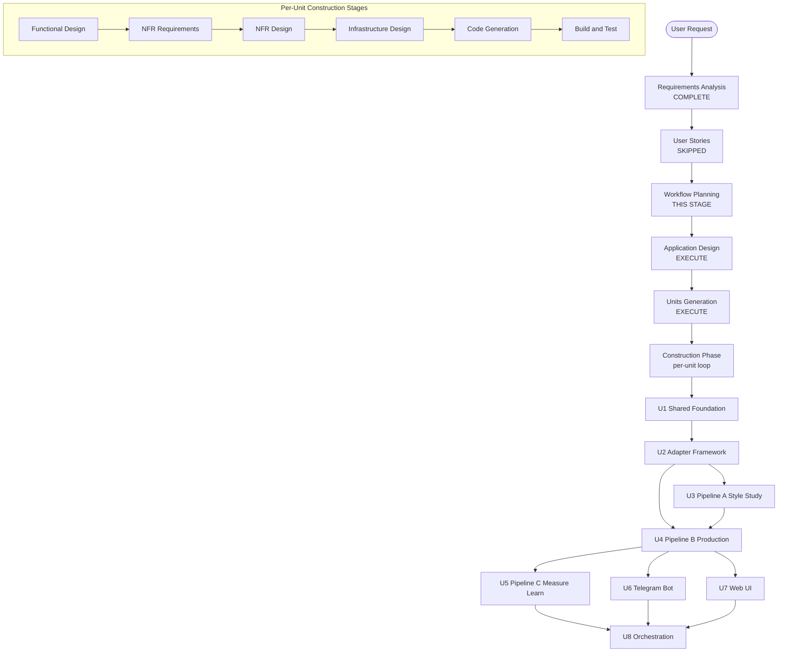

# Execution Plan: Reel-Mind

**Generated**: 2026-04-13
**Basis**: `docs/requirements.md`, `aidlc-docs/inception/requirements/requirements.md`
**Extensions enabled**: Security Baseline, Property-Based Testing (full)

---

## 1. Remaining Inception Stages

| Stage | Decision | Reasoning |
|-------|----------|-----------|
| User Stories | ⏭️ SKIP | Single-operator internal tool; behavior already captured in FR-005/010/011/012 |
| Application Design | ✅ EXECUTE | 3 pipelines + Web UI + Telegram bot + adapter framework + shared data layer — all new components with non-trivial dependencies |
| Units Generation | ✅ EXECUTE | Clear multi-unit decomposition; explicit unit boundaries needed for ordered construction and to keep the scope solo-operator tractable |

## 2. Construction Phase Plan

Applied **per unit** defined in Units Generation.

| Stage | Decision | Reasoning |
|-------|----------|-----------|
| Functional Design | ✅ EXECUTE | Complex business logic: style extraction, plan synthesis, hybrid routing, budget governance, warmup/cadence enforcement |
| NFR Requirements Assessment | ✅ EXECUTE | Availability (24/7), security (OAuth tokens), observability, cost governance, ToS compliance are central — not incidental |
| NFR Design | ✅ EXECUTE | Follows from NFR Requirements; required to translate NFRs into adapter contracts, schema decisions, retry/idempotency semantics |
| Infrastructure Design | ✅ EXECUTE | Non-trivial: Supabase schema with RLS, R2 bucket layout, GHA matrix workflows, per-channel secrets, Vercel deploy, cron cadences |
| Code Generation | ✅ EXECUTE | Always |
| Build and Test | ✅ EXECUTE | Always; PBT extension mandates property-based tests for pipeline logic, serialization, and state transitions |

## 3. Proposed Units (preview; finalized in Step 13 Units Generation)

| # | Unit | Purpose | Order |
|---|------|---------|-------|
| U1 | Shared Foundation | Supabase schema, data model, config loader, secrets abstraction, structured logging, artifact (R2) client | 1 |
| U2 | Adapter Framework | Interface definitions + registry for source / generative-video / publishing / TTS / stock-media adapters | 2 |
| U3 | Pipeline A — Style Study | StyleProfile extraction, versioning, persistence | 3 |
| U4 | Pipeline B — Content Production | Trend scout → plan → generate → approval gate → publish (MVP-critical path) | 4 |
| U5 | Pipeline C — Measure & Learn | Metrics ingestion, StyleSignal / TrendSignal prior updates | 5 |
| U6 | Telegram Bot | Approval flow + alert push | 6 |
| U7 | Web UI | Next.js dashboard (Channels overview + Approval queue for MVP) | 7 |
| U8 | Orchestration | GHA workflows, matrix, cron, per-channel secrets layout | 8 |

**Dependency notes**: U1 → everything. U2 → U3/U4/U5. U4 depends on U3 (reads StyleProfile). U6 and U7 depend on U1 (shared state) and U4 (approval semantics). U8 wraps U3/U4/U5.

**MVP critical path**: U1 → U2 → U4 (minimal: 1 source adapter, 1 YouTube publisher, asset-assembly only) → U6 (approval) → U7 (minimal dashboard) → U8. Pipelines A and C can ship second.

## 4. Workflow Visualization

## 5. Extension Compliance

- **Security Baseline**: Blocking rules applied at Functional Design, NFR Design, Infrastructure Design, Code Generation, Build and Test for every unit that handles credentials, tokens, user input, or external API calls (U1, U2, U4, U6, U7, U8).
- **Property-Based Testing (full)**: Blocking rules applied at Build and Test for every unit containing pure functions, serialization, state machines, or numeric/budget logic (U1, U3, U4, U5 especially).
- Neither extension should block U1/U2/U3; they shape design rather than forbid it.

## 6. Critical Risks Flagged for Design Stages

1. **Per-channel credential isolation** — must be solved at U1 (secrets abstraction) before any adapter is implemented.
2. **Idempotency of publishing** — re-running a failed Pipeline B run must not double-publish; surface at U4 Functional Design.
3. **StyleProfile version pinning** — immutable + versioned from day 1; surface at U1 and U3.
4. **Budget accounting attribution** — every paid call tagged `(channel_id, pipeline, run_id)`; surface at U1 (logging) and U2 (adapter contracts).
5. **GHA 6h limit** — surface at U8 Infrastructure Design; define offload trigger threshold.
6. **Korean-language quality** — TTS and subtitle rendering must be evaluated against native samples; surface at U4 Functional Design.
